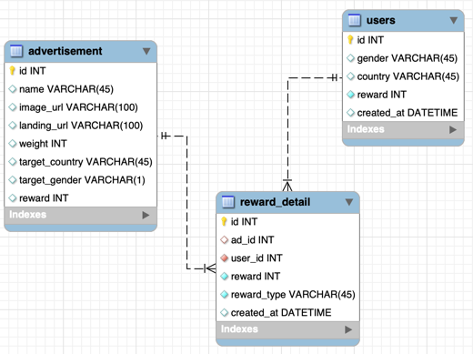

# 목차

1. [프로젝트명](#프로젝트명)
2. [프로젝트 설명](#프로젝트-설명)
3. [프로젝트 실행 방법](#프로젝트-실행-방법)


* * *

# 프로젝트명
> ad-server-project

프로젝트는 ad-server-project 폴더에 구현되어 있습니다.
# 프로젝트 설명
간단한 광고 서버 프로젝트 입니다.

### 개발
- 개발언어: Golang:1.18
- web 프레임워크: [Gin](https://github.com/gin-gonic/gin)
- docker-compose:3.8

### 데이터베이스
- MySQL:8.0.31
- 관계형 데이터베이스로 가장 많이 쓰이는 MySQL 사용했습니다.

### 구조 설계
폴더 구조는 아래와 같습니다.


```bash
ad-server-project
├── src
    └── adapter
    └── domain
      └── model
    └── repository
    └── usecase
    └── main.go
├── initdb.d

```
- model: 개체의 구조와 메서드 정의합니다.
- repository: 데이터베이스와 연결, 데이터 처리를 담당합니다.
- usecase: 데이터를 가공, 비지니스 로직을 처리합니다.
- adapter: usecase의 output을 가져와 표시합니다.

### DB 테이블 설계
테이블 설계는 아래와 같습니다.



- advertisement: 광고
- reward_detail: 리워드 내역
  - ad_id: 리워드를 적립할 때, 리워드에 해당하는 광고의 고유값을 저장합니다.
  - user_id: 리워드 내역의 당사자인 유저의 고유값을 저장합니다.
  - reward_type은 plus(적립), minus(차감) 두가지로 저장합니다.
- users: 사용자
  - gender, country: 유저의 성별, 국가 정보를 저장합니다.
  - reward: 유저가 보유한 리워드 값을 저장합니다.

## 기능 설명
서버에 광고 송출 요청을 보내 광고의 리스트를 반환하여 유저에게 광고 리스트를 송출합니다.
- 광고 정보의 country, gender 조건에 맞는 광고 송출
- 4가지 정렬 방법에 따른 광고 리스트 정렬
  - 랜덤으로 정렬
  - weight 기반 정렬
  - 예측된 CTR의 내림차순으로 정렬
  - 예측된 CTR과 weight 혼합 정렬
- 광고 정보 수정

# 프로젝트 실행 방법
도커가 설치되어있어야 합니다.

[Docker](https://www.docker.com/get-started) 설치 & 로그인 (tested on v4.3.0)


프로젝트를 다운받아 프로젝트 폴더로 이동합니다.
```bash
git clone https://github.com/buzzvil-assignments/sooutt-naver.com.git

cd ad-server-project
```

서버를 실행합니다.
```bash
make up
```
- 해당 명령어를 실행 하면, 프로젝트 이미지를 build 하여 docker-compose 로 띄우게 됩니다.
- MySQL 데이터베이스를 완전하게 띄운 후에 서버를 실행하도록 했습니다.
- 데이터베이스를 docker-compose 로 구성하면서, 필요한 리소스 데이터를 initdb sql 파일을 이용하여 import 합니다.

http://localhost:8080/ 혹은 http://0.0.0.0:8080/ 접속했을 때, "Hello world"가 출력된다면 서버가 정상적으로 실행된 것입니다.

## API 명세서
https://documenter.getpostman.com/view/19629582/2s9YeBfEc8

# 테스트 코드 실행
## repository 테스트
`sqlmock`을 사용하여 데이터베이스 의존하지 않고 쿼리문을 확인하는 테스트를 구현하였습니다.
- `sqlmock`: 데이터베이스와 상호작용하는 코드를 테스트하는데 사용되는 가짜 SQL 드라이버

repository 테스트를 실행하고, coverage를 출력하는 명령어는 아래와 같습니다.
```bash
make td-repository
``` 

## usecase 테스트
`mockery`, `testify`를 사용하여 DB와의 영속성 보다는 비지니스 로직을 검증합니다.
- 데이터를 Mocking하여 가상의 데이터를 생성하고 비지니스 로직이 잘 작동하는지 확인합니다.
- `mockery`: 명령어를 사용하여 특정 인터페이스(repository_interface)에 대한 mock을 자동으로 생성합니다.
- `testify`: Go언어 테스트 라이브러리로, suite 패키지를 사용하여 여러가지의 테스트 케이스를 그룹화하였습니다.

usecase 테스트를 실행하고, coverage를 출력하는 명령어는 아래와 같습니다.
```bash
make td-usecase
```


